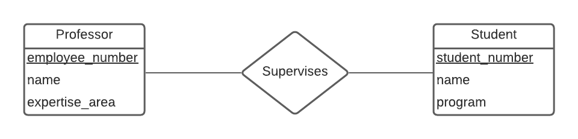
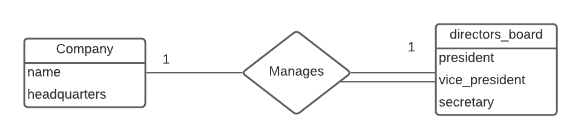

# CSI2532_Devoir1

## Sommaire

| Sommaire | Valeur |
| --- | --- |
| Cours | CSI 2532 |
| Session | Hiver 2021 |
| Professeur | Andrew Forward |
| Equipe | Younes Anys (300145843) |

## Partie A [60 points]: Modèles E-R
## A1 [15 points]: Relations, cardinalité et participation
a)

b)

c)

