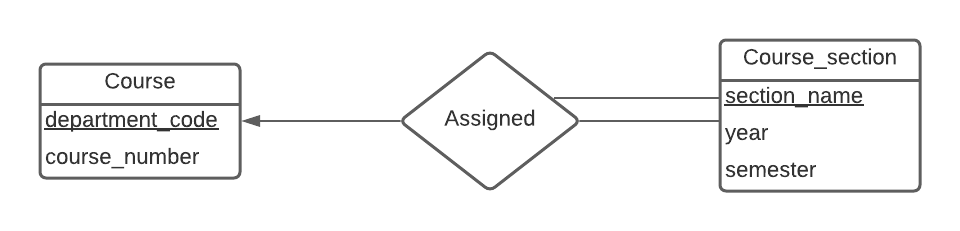

# CSI2532_Devoir1

## Sommaire

| Sommaire | Valeur |
| --- | --- |
| Cours | CSI 2532 |
| Session | Hiver 2021 |
| Professeur | Andrew Forward |
| Equipe | Younes Anys (300145843) |

## Partie A [60 points]: Modèles E-R
## A1 [15 points]: Relations, cardinalité et participation

a)


b)



c)


## A2 [30 points]: Conception du système


##  A3 [15 points]: Algèbre relationnelle

a) 


b)


## Partie B [60 points]: SQL
## B1 [15 points]: Lecture de requêtes SQL

a) [4 points]
| name   | experience |
|:------:|:----------:|
| andrew | 3          |
| august | 1          |
| hayden | 2          |

b) [4 points]
| name    | released_date |
|:-------:|:-------------:|
| MS Word | 2011-01-20    |
| Sketch  | 2016-06-15    |

c) [7 points]
| id | name   | num |
|:--:|:------:|:---:|
| 49 | hayden | 1   |

## B2 [15 points]: Écriture de requêtes SQL

a) [3 points] 
```
SELECT name
FROM users
WHERE join_date < '2020-01-01';
```
| name   |
|:------:|
| andrew |
| hayden |

b)  [5 points]
```
SELECT name, count(software_name) AS num_licenses
FROM users LEFT JOIN licenses ON users.id = licenses.user_id
GROUP BY name
ORDER BY num_licenses DESC, name ASC;
```
|  name  | num_licenses |
|:------:|:------------:|
| andrew |       2      |
| august |       1      |
|  ayana |       1      |
| hayden |       1      |

c)  [5 points] 
```
INSERT INTO licenses (user_id, software_name, access_code) VALUES
(49, 'Sketch', 'abc125'),
(49, 'Chrome', 'def457');
```
|  name  | num_licenses |
|:------:|:------------:|
| hayden |       3      |
| andrew |       2      |
| august |       1      |
|  ayana |       1      |

d)  [2 points] 
```
UPDATE softwares
SET version = '51', released_date = '2020-01-01'
WHERE name = 'Sketch';
```
## B3 [30 points]: Mise à jour le schéma SQL
### a)
```
BEGIN;
ALTER TABLE licenses
ADD version varchar(100);
COMMIT;
```

### b)
```
BEGIN;
ALTER TABLE softwares
DROP CONSTRAINT softwares_pkey;

ALTER TABLE softwares
ADD CONSTRAINT softwares_pkey PRIMARY KEY (name, version);
COMMIT;
```

### c)
```
ALTER TABLE licenses
DROP CONSTRAINT licenses_pkey;

ALTER TABLE licenses
ADD CONSTRAINT licenses_pkey PRIMARY KEY (user_id, software_name, version);
COMMIT;
```

### d)
```
BEGIN;
INSERT INTO licenses (user_id, software_name, access_code, version) 
SELECT id, 'Sketch', '1monthfree', '52'
FROM users AS u LEFT JOIN(
	SELECT user_id, software_name, access_code, version 
	FROM licenses 
	WHERE software_name = 'Sketch' AND version = '52') 
AS l on u.id = l.user_id
WHERE software_name IS NULL;
COMMIT;
```
